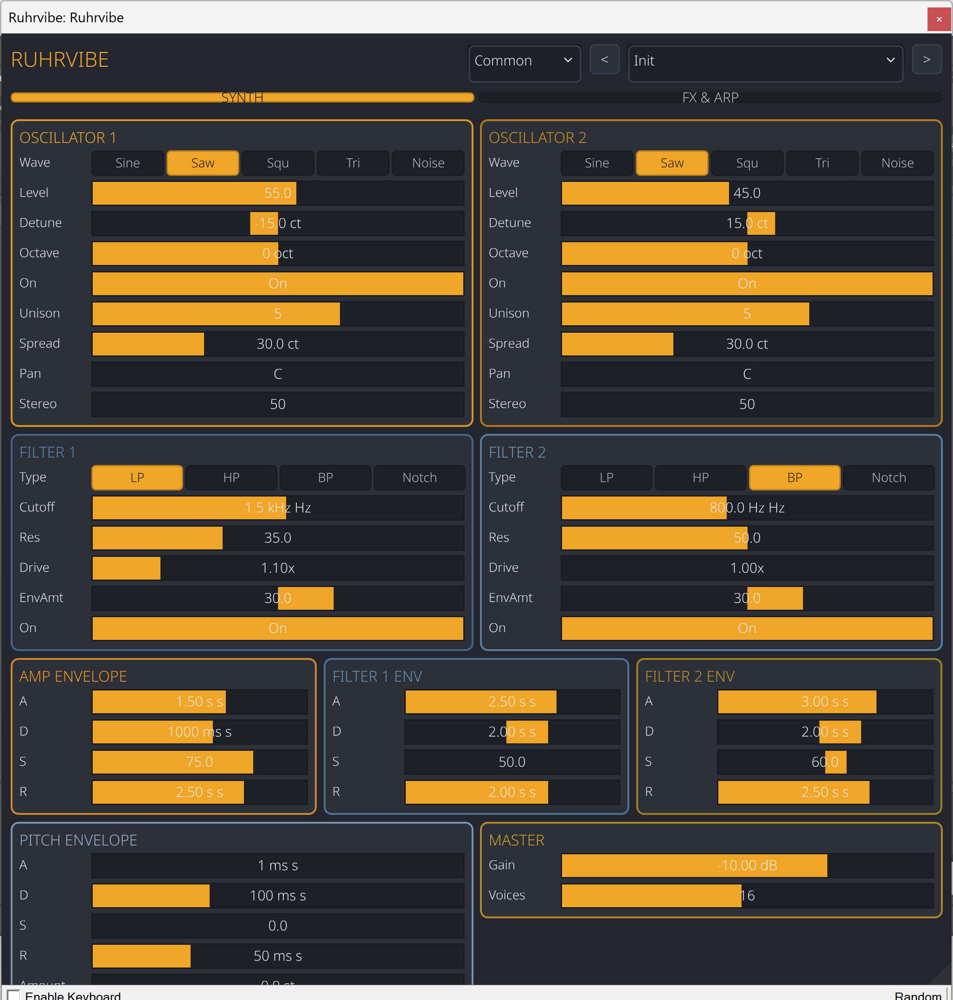
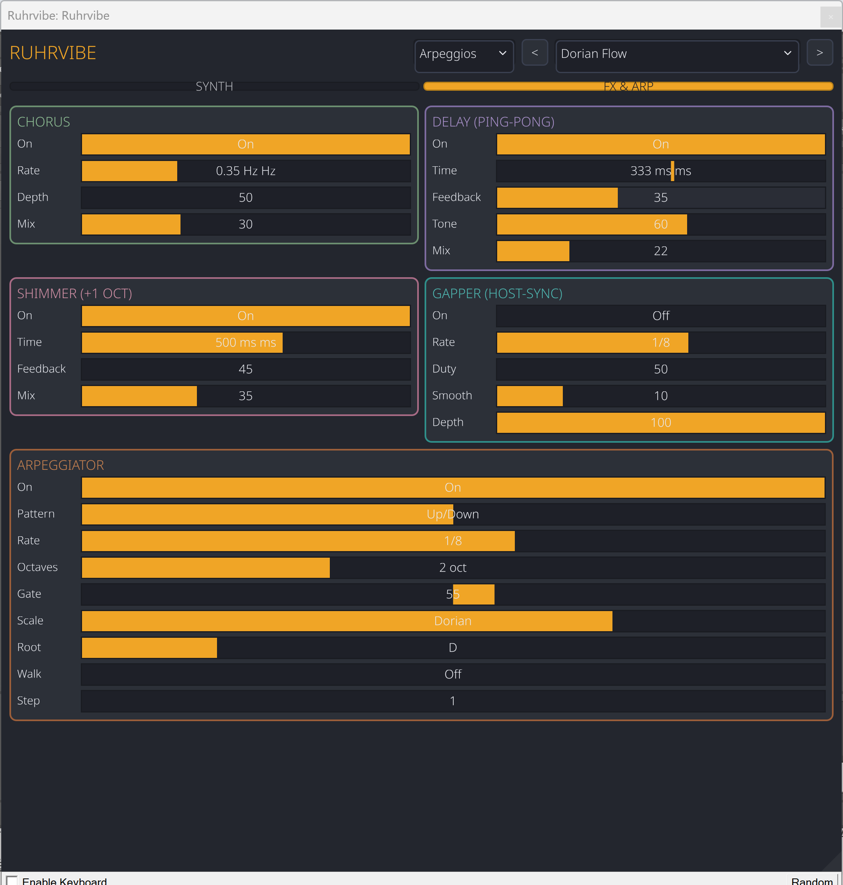

# Ruhrvibe — User Guide


A polyphonic subtractive synthesizer in VST3 and CLAP format. This guide covers
every control on the plugin, how the signal flows, and how to actually coax
sound out of the thing.

---

## Contents

1. [Installation](#installation)
2. [Interface overview](#interface-overview)
3. [The SYNTH tab](#the-synth-tab)
   - [Oscillators](#oscillators)
   - [Filters](#filters)
   - [Envelopes](#envelopes)
   - [Master](#master)
4. [The FX & ARP tab](#the-fx--arp-tab)
   - [Chorus](#chorus)
   - [Delay](#delay)
   - [Shimmer](#shimmer)
   - [Gapper](#gapper)
   - [Arpeggiator](#arpeggiator)
5. [Presets](#presets)
6. [Signal flow](#signal-flow)
7. [Recipes](#recipes)
8. [Troubleshooting](#troubleshooting)

---

## Installation

Ruhrvibe ships as a single bundle containing both the VST3 and CLAP builds.

**Windows:** copy `Ruhrvibe.vst3` into
`C:\Program Files\Common Files\VST3\` (the standard system VST3 folder). Your
DAW should detect it on the next plugin rescan.

Requires a 64-bit VST3 or CLAP host. Tested with REAPER, Bitwig, Renoise, and
Ableton Live. Other hosts almost certainly work — the nih-plug framework
targets the standard plugin APIs.

---

## Interface overview

The plugin window has three regions, top to bottom:

- **Header** — the plugin name and the preset browser.
- **Tab bar** — two tabs: **SYNTH** and **FX & ARP**.
- **Content** — changes with the active tab.

Every knob/slider works the same way: drag to change, double-click to type a
value, right-click (or ctrl-click) for host options (MIDI learn, automation,
reset to default). Parameter values update in real time; no click-to-commit.

> **Screenshot:** 
> *(Fill in a capture of the full plugin with the SYNTH tab active.)*

---

## The SYNTH tab

Everything that shapes *tone* per note lives here: oscillators, filters,
envelopes, and the master section.

### Oscillators

Two independent oscillators per voice, each with its own waveform, level,
pitch, unison, and stereo placement.

| Parameter | Range | What it does |
|-----------|-------|--------------|
| **Wave** | Sine · Saw · Square · Triangle · Noise | Source waveform. Saw/Square are anti-aliased with PolyBLEP. Noise is broadband white noise (doesn't pitch-track). |
| **Level** | 0–100 % | Amplitude going into the mix. Two oscs at 100 % each can clip — leave headroom. |
| **Detune** | ±100 cents | Fine-tune in cents (hundredths of a semitone). Small values between the two oscs produce thick, beating textures. |
| **Octave** | ±3 oct | Coarse pitch in whole octaves. |
| **Unison** | 1–7 | Number of stacked detuned copies of *this* oscillator. Unison=1 is a single voice; 7 is supersaw territory. |
| **Spread** | 0–100 cents | Total detune range across unison copies. Ignored when Unison=1. |
| **Pan** | L ↔ R | Static stereo position for the oscillator. |
| **Stereo** | 0–100 % | How much of the unison spread is panned left/right. 0 = all copies centred; 100 = full width. |
| **On** | on/off | Bypass the oscillator entirely (saves CPU). |

**Notes on waveforms**

- **Sine** — pure, no harmonics. Good for sub-bass and additive layering.
- **Saw** — all harmonics, bright and buzzy. The default "synth" sound.
- **Square** — odd harmonics only, hollow/woody. Great for leads, 8-bit.
- **Triangle** — mostly-fundamental with weak odd harmonics. Soft, flute-like.
- **Noise** — pitchless white noise. Useful for drum layers, wind, transients.

### Filters

Two filters in **series** (Filter 1 → Filter 2). Each voice gets its own
independent filter state, so polyphony is clean.

| Parameter | Range | What it does |
|-----------|-------|--------------|
| **Type** | LP · HP · BP · Notch | Lowpass, highpass, bandpass, or notch response. |
| **Cutoff** | 20 Hz – 20 kHz | Corner frequency (log-scaled knob). |
| **Res** | 0–100 % | Resonance — emphasis at the cutoff. High values self-oscillate, lower cutoff simultaneously for best results. |
| **Drive** | 1×–4× | Pre-filter saturation. Adds harmonics, can compensate for level loss from heavy filtering. |
| **Env Amt** | ±100 % | How much the filter envelope modulates cutoff. Positive opens the filter as the envelope rises; negative closes it. |
| **On** | on/off | Bypass the filter slot. |

Under the hood this is a Cytomic-style state variable filter with zero-delay
feedback. It stays stable at high resonance without going supernova, which is
more than can be said for most naïve biquad implementations.

### Envelopes

Four envelopes total: one for amplitude, one for each filter slot, and one for
pitch.

**Amp envelope** — shapes each note's volume. Standard ADSR.

**Filter 1 / Filter 2 envelopes** — shape each filter's cutoff via that slot's
**Env Amt**. If Env Amt = 0, the envelope does nothing.

**Pitch envelope** — shapes pitch over time, useful for percussive *bwoom*
effects, risers, synth kicks. Adds its own **Amount** in semitones (positive =
pitch sweeps up from lower start; negative = sweeps down from higher start).

All envelopes share the same ADSR parameter set:

| Parameter | Range | What it does |
|-----------|-------|--------------|
| **A** (Attack) | 1 ms – 10 s | Time from note-on to peak. |
| **D** (Decay) | 1 ms – 10 s | Time from peak down to sustain level. |
| **S** (Sustain) | 0–100 % | Level held while the key is down. |
| **R** (Release) | 1 ms – 10 s | Time from key-up to silence. |

### Master

| Parameter | Range | What it does |
|-----------|-------|--------------|
| **Voices** | 1–32 | Polyphony cap. When the cap is hit, the quietest voice is stolen. |
| **Gain** | −60 dB – +6 dB | Final output level after FX. |

---

## The FX & ARP tab

All effects and the arpeggiator live here. Effects process the *mixed* voice
output (not per-voice), in this chain:

```
Voices → Chorus → Delay → Shimmer → Gapper → Master Gain → Output
```

Each effect has an **On** toggle; toggle it off to bypass entirely (no CPU
cost, no signal colouring).

> **Screenshot:** 
> *(Fill in a capture of the full plugin with the FX & ARP tab active.)*

### Chorus

A stereo chorus — two short, modulated delay lines panned opposite.

| Parameter | Range | What it does |
|-----------|-------|--------------|
| **Rate** | 0.05–10 Hz | LFO speed for the delay modulation. |
| **Depth** | 0–100 % | How far the delay time swings. |
| **Mix** | 0–100 % | Dry/wet balance. |

### Delay

A stereo ping-pong delay with a tone control.

| Parameter | Range | What it does |
|-----------|-------|--------------|
| **Time** | 1–2000 ms | Delay time (log-scaled). |
| **Feedback** | 0–95 % | How much of the echo feeds back for repeats. 95 % is effectively infinite. |
| **Tone** | 5–100 % | Low-pass on the feedback path. Low values give darker, more analog-sounding repeats. |
| **Mix** | 0–100 % | Dry/wet balance. |

### Shimmer

A delay with an **octave-up pitch shifter** in the feedback loop. Each
repetition rises an octave, producing the bright, angelic shimmer-reverb
sound.

| Parameter | Range | What it does |
|-----------|-------|--------------|
| **Time** | 1–2000 ms | Delay time. |
| **Feedback** | 0–90 % | Feedback gain. Higher = more octave stacks. |
| **Mix** | 0–100 % | Dry/wet balance. |

### Gapper

A host-synced rhythmic gate (trance gate). Cuts the signal in and out in time
with the host tempo.

| Parameter | Range | What it does |
|-----------|-------|--------------|
| **Rate** | 1/1 – 1/32 (+ dotted + triplet) | Gate cycle length in musical divisions. |
| **Duty** | 5–95 % | Fraction of the cycle that's *open*. 50 % = even on/off. |
| **Smooth** | 0–50 % | Softens the edges (crossfade). 0 = hard clicks, 50 % = almost sine-shaped pulsing. |
| **Depth** | 0–100 % | How far the gate attenuates. 100 % = fully muted when closed. |

If the host isn't playing, the gapper free-runs from the host's tempo value.

### Arpeggiator

The arpeggiator sits **before** the voice allocator: it consumes incoming MIDI
notes and emits rhythmic note-ons/-offs, which the synth then plays like
ordinary MIDI.

#### Basic controls

| Parameter | Range | What it does |
|-----------|-------|--------------|
| **On** | on/off | Enable the arp. While on, held chords don't sustain — they're arpeggiated. |
| **Pattern** | Up · Down · Up/Down · Random · As Played | Note order. |
| **Rate** | 1/1 – 1/32 (+ dotted + triplet) | Tempo-synced step length. |
| **Octaves** | 1–4 | How many octaves the sequence spans. |
| **Gate** | 5–95 % | Note length as a fraction of the step. Low = staccato, high = legato. |

Patterns:
- **Up** — ascending through held notes (and octaves).
- **Down** — descending.
- **Up/Down** — ascend then descend without repeating endpoints.
- **Random** — random pick each step.
- **As Played** — in the order you pressed keys.

#### Scale-lock (Scale + Root)

By default the arp plays only the notes you hold. Turn on scale-lock to snap
every arpeggiated pitch to a chosen musical scale — great for keeping a held
chord "in key" when it extends across octaves, or for cleaning up detuned
input.

| Parameter | Options | What it does |
|-----------|---------|--------------|
| **Scale** | Off · Major · Minor · Penta Maj · Penta Min · Dorian · Mixolydian · Blues | Note set to snap to. Off = chromatic (no snapping). |
| **Root** | C · C# · D · … · B | Which pitch the scale is anchored to. |

When `Scale ≠ Off`, any output pitch that isn't in the scale is moved to the
nearest in-scale pitch class (ties go *down* — fewer accidentals).

#### Scale Walk + Step

Normally the arp only plays the notes you hold. That means pressing **one**
key only gives you that note plus its octave copies — boring.

Turn on **Walk** and the arp instead expands a single held key into a walk
through the selected scale. The held key becomes the starting pitch; the arp
steps through scale degrees from there.

| Parameter | Range | What it does |
|-----------|-------|--------------|
| **Walk** | on/off | Enable scale-walk mode (requires a non-Off Scale). |
| **Step** | 1–7 scale degrees | How many scale degrees to stride per tick. 1 = seconds (stepwise), 2 = thirds, 3 = fourths, etc. |

Examples, all with `Scale = Major`, `Root = C`, `Octaves = 1`:

- Hold `C`, `Step = 1` → plays `C D E F G A B C …`
- Hold `G`, `Step = 1` → plays `G A B C D E F G …`
- Hold `C`, `Step = 2` → plays `C E G B D F A C …` (cycle of thirds)
- Hold `C`, `Step = 3` → plays `C F B E A D G C …` (cycle of fourths)

The held note is snapped to the scale first — pressing an out-of-scale key
(say `C#` in C Major) starts the walk from the nearest in-scale pitch.

Walk mode ignores chord shape: only the **lowest held key** anchors the walk.
That's usually what you want for one-finger arps; for chord-based arps, leave
Walk off.

#### A mental model

| You hold | Walk off | Walk on |
|----------|----------|---------|
| One key | Plays that key + octaves | Walks the scale from that key |
| Chord (C–E–G) | Cycles C→E→G→C… | Walks scale from C (lowest) |
| Chord with Scale=Off | Chromatic cycle of held notes | Not useful (Scale=Off disables walk semantics) |

---

## Presets

The header has three dropdowns:

1. **Category** — filters the preset list.
2. **Preset** — the actual patch to load.
3. **◀ / ▶** (prev/next) — step through presets in the current category.

Categories:

| Category | Count | What's inside |
|----------|-------|---------------|
| Common | 17 | General-purpose classics: Init, Fat Bass, Warm Pad, Pluck, Lead, Sub Bass, Strings, Brass, Piano, etc. Also drum-ish patches (Kick/Snare/Hi-Hat) for quick ideas. |
| Bass | 11 | 808 Sub, Reese, Acid, Wobble, Moog, FM Slap, Pluck Bass, Growl, Chop Bass, Deep Rumble, Detuned Growl. |
| Keys | 10 | EP Rhodes, Clav, Wurli, Grand Keys, Mellotron, Vintage Organ, Synth Keys, Glass Piano, Electric Lead, Music Box. |
| Pads | 10 | Lush, String Pad, Choir, Dark Pad, Sci-Fi Pad, Organic, Glass Pad, Evolving, Brass Pad, Warm Pad Deluxe. |
| Drums | 10 | Deep Kick, 808 Snare, Clap, Closed HH, Open HH, Crash, Rimshot, Wood Block, Cowbell, Tambourine. |
| Oneshots | 10 | Stab, Pluck Hit, Laser Zap, Big Impact, Riser, Downlifter, Sweep, Boom, Click, Thump. |
| Arpeggios | 19 | 10 classic arps, 6 scale-locked, 3 scale-walk demos. See below. |
| Soundscapes | 10 | Ocean, Wind, Space Drone, Distant Thunder, Haunted Hall, Alien Comm, Crystal Cave, Rain, Fog Horn, UFO. |
| Atmospheres | 10 | Sci-Fi Drone, Horror, Ambient Wash, Dark Cloud, Epic Build, Cold Space, Warm Hug, Tension Drone, Mystical Bells, Distant Dream. |
| 8-Bit | 8 | Lo-fi square/triangle patches in the style of early game consoles. |
| Fun | 4 | Novelty patches: Alf, Cat, Elton, Grand Pa. |

**Arpeggio showcase patches** (great for exploring the scale features):

- *Classic Up* / *Trance Gate* / *Octave Stack* — old-school held-chord arps.
- *Penta Bliss* / *Koto Ladder* / *Dorian Flow* / *Mixo Groove* / *Blues Stab* /
  *Minor Chants* — scale-locked arps. Hold any chord; it stays in key.
- *Walk Up Major* / *Walk Thirds Penta* / *Walk Dorian Flow* — scale-walk arps.
  Press *one* key and the arp plays a full scale pattern from it.

---

## Signal flow

Per voice (16 independent voices by default, 32 max):

```
            ┌────── Detune / Octave / Unison / Stereo ──────┐
Osc 1 ──────┤                                               ├──┐
            └────────── Pan ───────────────────────────────┘  │
                                                               Mix ──► Filter 1 ──► Filter 2 ──► Amp Env ──► Voice Out
            ┌────── Detune / Octave / Unison / Stereo ──────┐ │          ▲             ▲
Osc 2 ──────┤                                               ├──┘         │             │
            └────────── Pan ───────────────────────────────┘           Flt1 Env     Flt2 Env

Pitch Env modulates the oscillator frequencies.
```

Global (all voices summed):

```
Voice Bus → Chorus → Delay → Shimmer → Gapper → Master Gain → Stereo Out
```

MIDI path (when arp is on):

```
Host MIDI ──► Arpeggiator ──► Voice Allocator ──► 16×Voice ─► Voice Bus
```

---

## Recipes

**Fat, detuned supersaw lead**
- Osc 1: Saw, Unison 7, Spread 30, Stereo 100 %.
- Osc 2: Saw, Octave −1, Unison 5, Spread 20, Level 70 %.
- Filter 1: LP, Cutoff 6 kHz, Res 30 %.
- Amp Env: fast A, short D to sustain.
- FX: Chorus Mix 35 %, Delay Mix 25 %.

**Punchy synth kick**
- Osc 1: Sine, Octave −2. Osc 2 off.
- Filter 1: LP, Cutoff 1 kHz, Env Amt 50 %.
- Amp Env: A 1 ms, D 250 ms, S 0, R 100 ms.
- Pitch Env: A 1 ms, D 60 ms, Amount +36 st. (pitch drop)
- Master Voices: 1 (monophonic thump).

**Scale-locked pluck arp**
- Pick the Pluck preset.
- Enable Arp, Rate 1/16, Octaves 2, Gate 40 %.
- Scale Major, Root C. Hold any chord — all arpeggiated notes stay in C major.

**One-finger scale walk melody**
- Pick any short/plucky patch.
- Arp: Pattern Up, Rate 1/16, Octaves 2.
- Scale Penta Major, Root C.
- **Walk on**, Step 1.
- Play single notes: each key launches a scale run from that pitch.

**Rhythmic pad (trance-gate)**
- Pick any pad.
- Enable Gapper, Rate 1/8, Duty 50 %, Smooth 10 %, Depth 100 %.
- Hold a chord. Start/stop the host transport to lock or free-run.

**Shimmer-wash ambient**
- Pick a pad or evolving texture.
- Shimmer: Time 600 ms, Feedback 60 %, Mix 40 %.
- Delay: Time 500 ms, Feedback 40 %, Mix 25 %.
- Attack long (1–2 s), Release long (3–5 s).

---

## Troubleshooting

**No sound when I play notes**
- Check Osc 1 **On** (and its Level). If both oscillators are off or at 0, you
  get silence.
- Check the Amp envelope Sustain isn't at 0 with a long Attack — you'd need to
  wait for the note to fade in.
- Check Master Gain isn't at −60 dB.

**Plugin is silent until I press several keys, then bursts**
- You're probably running with Voices = 1. Increase the voice cap.

**Notes get cut off when I hold many keys**
- Voice stealing kicked in. Raise **Voices**.

**Filter self-oscillates loudly / hurts to listen to**
- Drop **Resonance** below ~90 %, or lower the cutoff so the resonant peak
  sits below the oscillators' fundamental.

**Arp sounds "only in octaves" with one key held**
- That's expected held-chord behaviour — an arp sequences the notes you hold,
  and one note has no other chord tones to cycle through. Turn on **Walk** for
  one-finger scale runs, or hold a full chord.

**Gapper/arp rhythm drifts away from the DAW beat**
- Make sure host transport is playing. When stopped, the gapper and arp
  free-run from the host tempo and aren't phase-locked to bar 1.

**Save/recall doesn't restore my patch**
- The plugin persists every parameter and the editor state. If the host's
  VST3 state save/restore isn't calling into the plugin, that's a host bug —
  try saving as a preset in the host's own format.

---

## Credits

- Audio engine & DSP: Rust on top of [nih-plug](https://github.com/robbert-vdh/nih-plug).
- GUI: [nih_plug_vizia](https://github.com/robbert-vdh/nih-plug/tree/master/nih_plug_vizia).
- Filter: Cytomic / Simper-style state variable filter, zero-delay feedback.
- Anti-aliasing: PolyBLEP for saw/square.

License: ISC.
